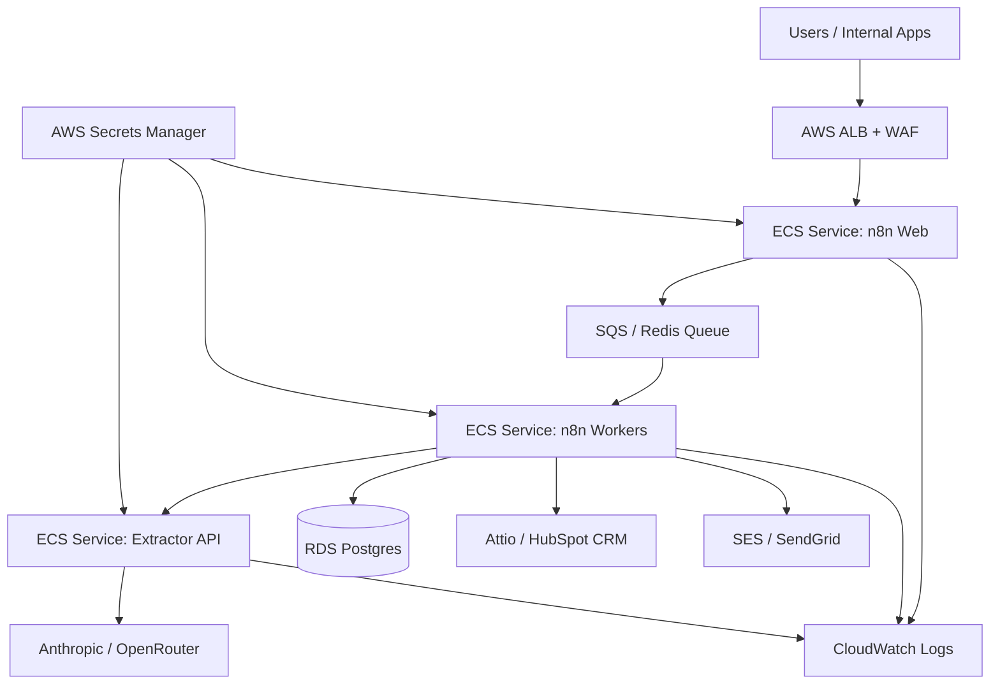

# Sentinel Flow: Intelligent Document Orchestration Engine

Sentinel Flow is an enterprise-ready proof of concept for document ingestion, AI analysis, risk-based routing, and downstream CRM/email actions.

It uses:

- **n8n** for orchestration, retries, execution history, and workflow visibility.
- **PostgreSQL** as the n8n execution/audit datastore.
- **FastAPI/Python** for document text extraction and schema-validated AI analysis.
- **OpenRouter or Anthropic** for real Claude-compatible AI calls.
- **SMTP sandbox / CRM API** for real downstream integration proof.
- **Docker Compose** for reproducible local deployment.

## What this PoC proves

1. A document can enter through a clean portal or webhook.
2. n8n orchestrates the business process.
3. Python extracts readable document text.
4. A real AI provider returns structured JSON.
5. The output is validated before action.
6. n8n routes based on risk/recommendation.
7. A real email or CRM action can be triggered.
8. Execution history provides auditability.
9. The architecture has a clear path to AWS production deployment.

## Production Blueprint



## Quick Start

### 1. Install requirements

- Docker Desktop or Docker Engine
- Docker Compose v2
- OpenRouter or Anthropic API key
- Optional: Ethereal/SendGrid SMTP sandbox credentials
- Optional: HubSpot/Attio API credentials

### 2. Configure environment

```bash
cp .env.example .env
```

Edit `.env` and set at least one real AI key:

```bash
AI_PROVIDER=openrouter
OPENROUTER_API_KEY=sk-or-v1-...
REQUIRE_REAL_AI=true
```

or:

```bash
AI_PROVIDER=anthropic
ANTHROPIC_API_KEY=sk-ant-...
AI_MODEL=claude-3-5-sonnet-20241022
REQUIRE_REAL_AI=true
```

### 3. Start the stack

```bash
docker compose up --build
```

Services:

- Portal: http://localhost:8080
- n8n: http://localhost:5678
- Extractor API: http://localhost:8000/health

### 4. Import the n8n workflow

1. Open n8n at `http://localhost:5678`.
2. Create the owner account if prompted.
3. Import `n8n/workflows/sentinel_flow.workflow.json`.
4. Configure SMTP credentials for `Send Review Email`.
5. Optional: configure HubSpot/Attio credentials and enable the CRM node.
6. Activate the workflow.

### 5. Run the demo

1. Open the portal at `http://localhost:8080`.
2. Keep the webhook URL as:

```text
http://localhost:5678/webhook/sentinel_flow/document
```

3. Paste a document or use `samples/high-risk-contract.txt`.
4. Click **Run Sentinel Flow**.
5. Open n8n execution history to show the complete audit trail.
6. Verify the real email or CRM action in your configured sandbox account.

## Hierarchical Core Logic

```text
Sentinel Flow
├── 1. Ingestion
│   ├── Client portal posts document text
│   └── n8n webhook receives payload
├── 2. Extraction
│   ├── n8n calls FastAPI extractor
│   ├── extractor reads text/PDF content
│   └── extractor calls OpenRouter/Anthropic
├── 3. Validation
│   ├── AI response must match strict JSON schema
│   └── invalid responses fail before business actions
├── 4. Routing
│   ├── high risk → review email
│   ├── crm_update → CRM record action
│   └── fallback → general review response
├── 5. Auditability
│   ├── n8n execution history
│   ├── Postgres-backed execution storage
│   └── version-controlled workflow JSON
└── 6. Enterprise Scale Path
    ├── AWS ECS services
    ├── RDS Postgres
    ├── Secrets Manager
    ├── CloudWatch logs
    └── GitHub Actions CI/CD
```

## Important demo note

The extractor is designed for real AI calls. If `REQUIRE_REAL_AI=true` and no valid AI key exists, analysis fails intentionally. This prevents accidentally presenting a fake demo as an AI-backed system.

For offline development only, set:

```bash
REQUIRE_REAL_AI=false
```

This enables a deterministic fallback marked with `DEV_ONLY_FALLBACK_USED`.

## Real Integration Options

### Email

Use Ethereal Email or SendGrid sandbox SMTP credentials inside n8n's SMTP credential manager. The high-risk route sends a review email.

### CRM

The workflow includes a disabled HubSpot API action template. Enable it after adding credentials. For Attio, replace the HubSpot URL/body with the Attio records endpoint and store the API key as an n8n credential.

## Files

```text
.
├── docker-compose.yml
├── .env.example
├── frontend/
├── extractor/
├── n8n/workflows/sentinel_flow.workflow.json
├── docs/architecture.md
├── docs/security-plan.md
├── docs/ci-cd.md
├── docs/loom-script.md
├── infra/aws/production-blueprint.md
├── .github/workflows/ci.yml
└── samples/high-risk-contract.txt
```
