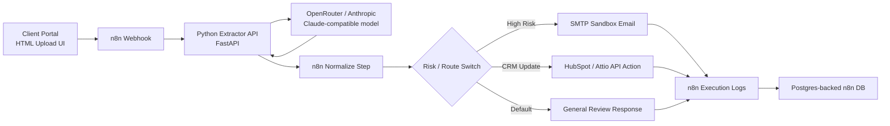
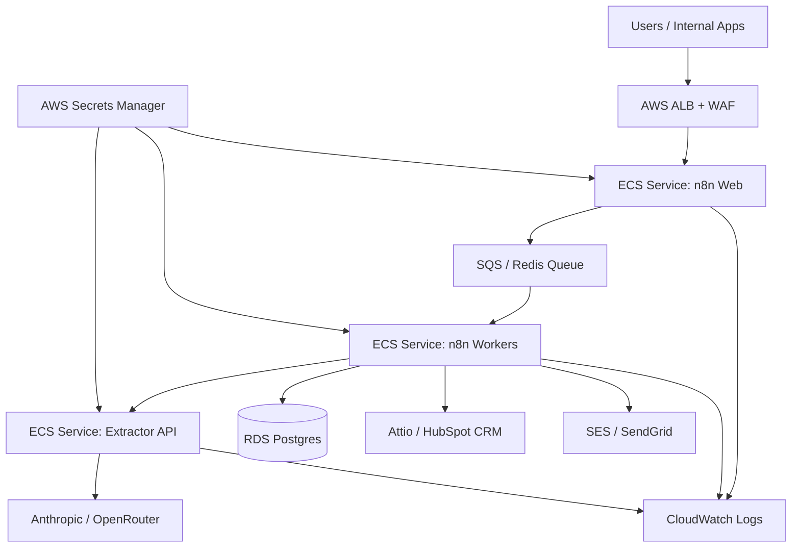

# Sentinel Flow Architecture

## Purpose

Sentinel Flow is a proof-of-concept document orchestration engine. It receives unstructured documents, extracts structured business data with an AI model, routes the result based on risk and recommended action, and triggers downstream CRM/email/task workflows.

## Local PoC

## Production Blueprint

## Core Logic Hierarchy

1. **Ingestion Layer**
   - Receives text/files through n8n webhook.
   - Optionally receives documents from email, Drive, forms, or CRM events.

2. **Extraction Layer**
   - Python service extracts readable text from TXT/PDF.
   - Sends bounded prompt to Claude/OpenRouter.
   - Validates returned JSON against a strict schema.

3. **Decision Layer**
   - Normalizes model output.
   - Classifies by `risk_level` and `recommended_route`.
   - Prevents invalid downstream actions by requiring typed structured data.

4. **Action Layer**
   - Sends review email for high-risk documents.
   - Creates/updates CRM records for safe business documents.
   - Logs execution result for auditability.

5. **Enterprise Layer**
   - Secrets managed outside code.
   - Execution history retained.
   - Logs shipped to CloudWatch.
   - Queues and workers scale independently.
   - CI/CD validates and packages every change.
